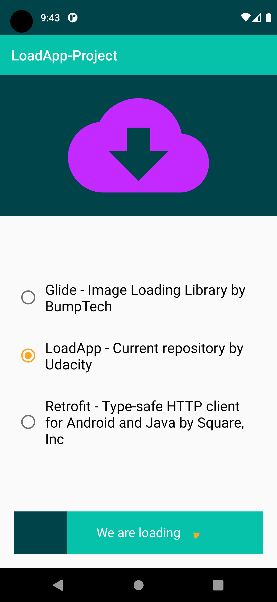

# Load-App
App for Advanced Android Developer Kotlin Nanodegree by Udacity that download a file from the Internet by clicking on a custom button

- Animate properties of the custom button once it's clicked
- The width of the button gets animated from left to right
- The text on the button gets changed based on different states of the button
- The circle on the button gets be animated from 0 to 360 degrees
- A notification will be sent once the download is complete. 
- The user clicks on the notification
- The user lands on detail activity and the notification gets dismissed. In detail activity
- The status of the download will be displayed and animated via MotionLayout.

## Screenshots

